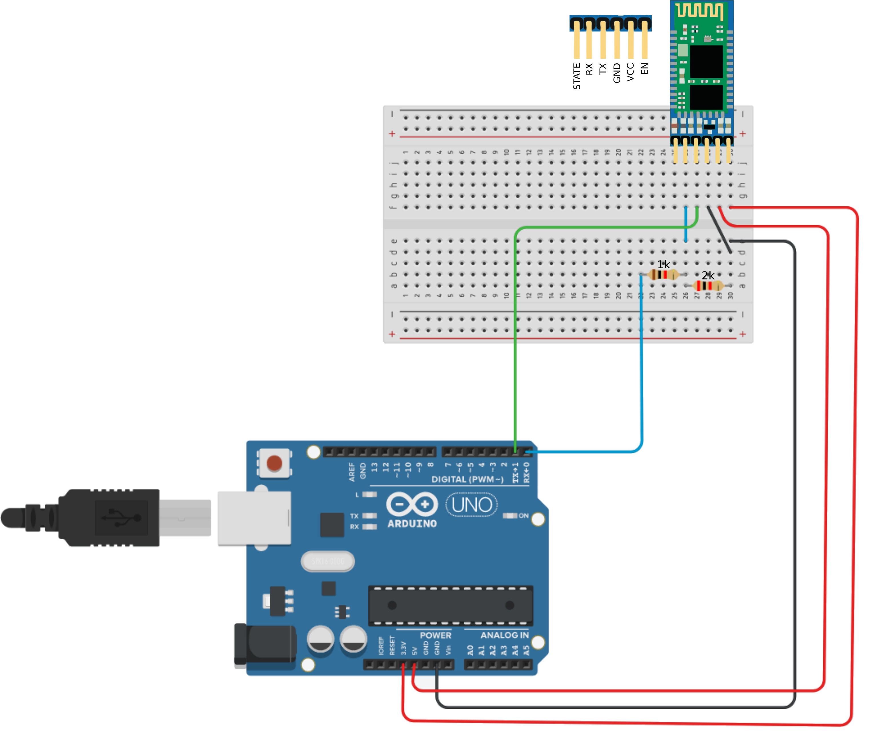
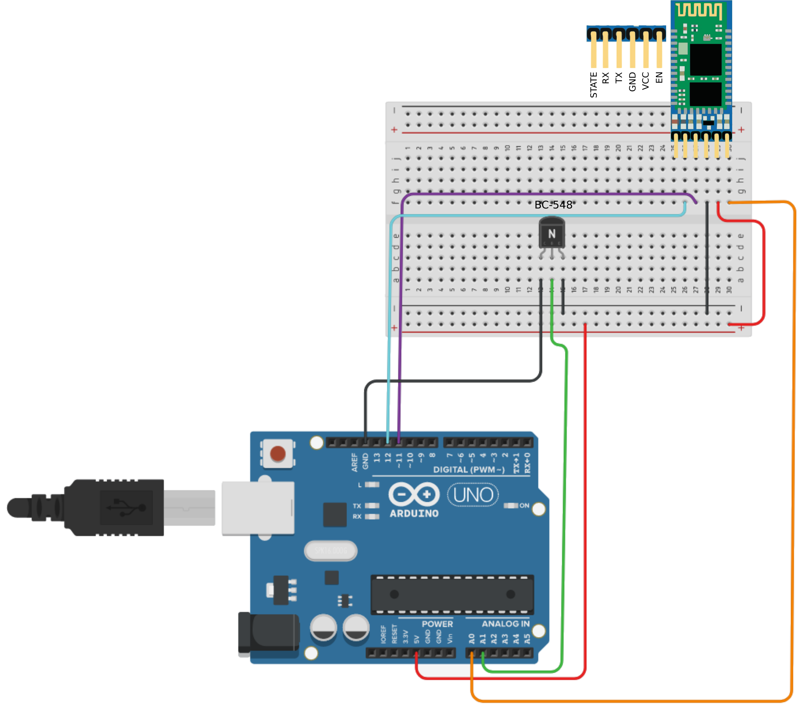
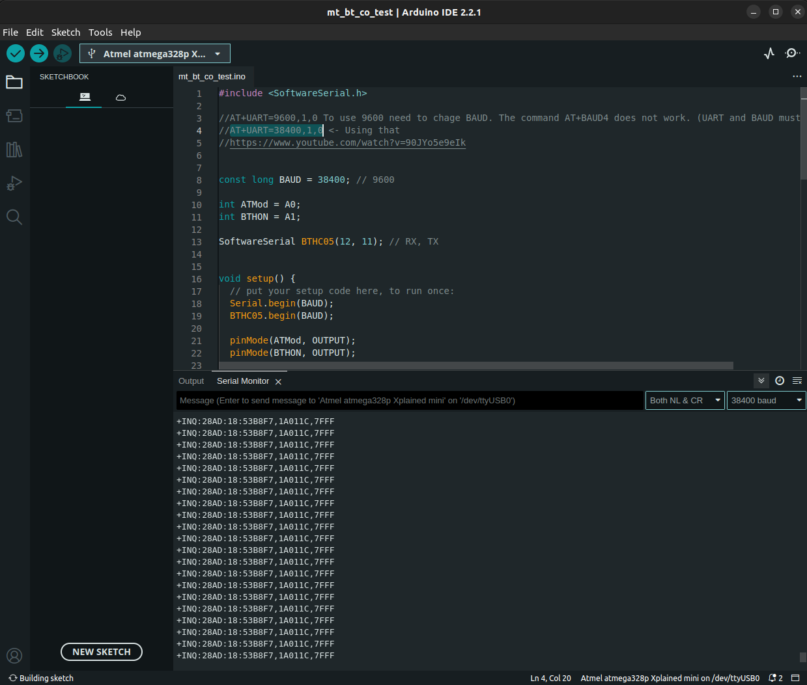

# arduino-bluetooth-hc-05

## AT command mode


The diagram shows how to connect the terminals so that the AT commands can be executed.
The Arduino must be running a basic program.

## Use case


The diagram shows how to connect the terminals to control all aspects of the module via serial communication.

## mt_bt_co_test

This code, allow us to control the bluetooth module.

Commands:

- conf+: Turn on the configuration pin (EN).
- conf-: Turn off the configuration pin (EN).
- on: Turn on the module.
- off: Turn off the module.
- AT: All commands beginning with AT will be sent to the module.

# AT+INQ ERROR (1F), AT+INIT ERROR(17)

During the tests, the AT+INQ and AT+INIT commands didn't work. This video gives us some solutions: https://www.youtube.com/watch?v=90JYo5e9eIk. In my case, I set the baud rate of SerialSoftware and AT+UART to the same value: ```AT+UART=38400,1,0```

After that, I restarted the module and ran the configuration mode, after a few seconds the list of devices was displayed on the serial console.

